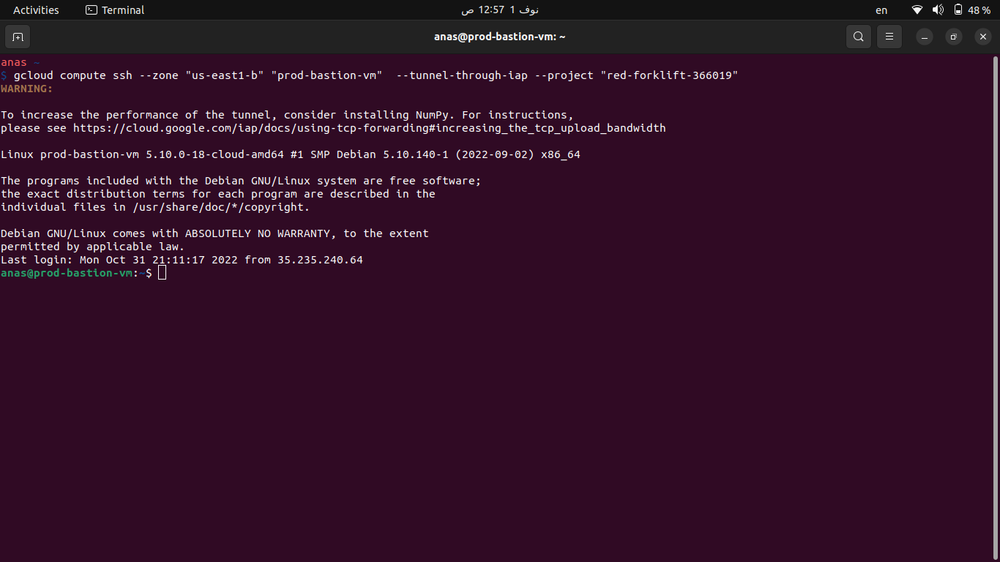
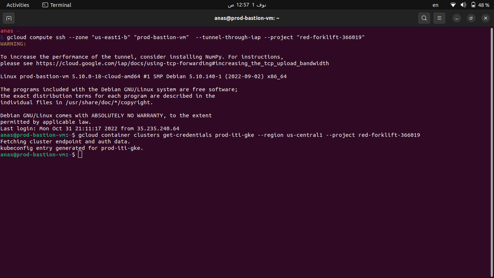
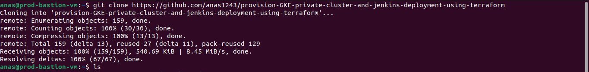
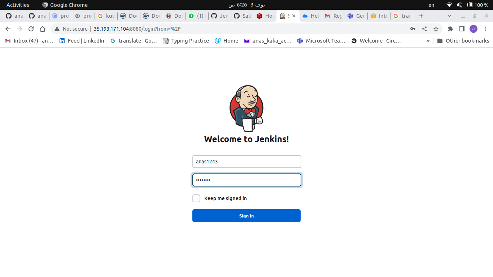
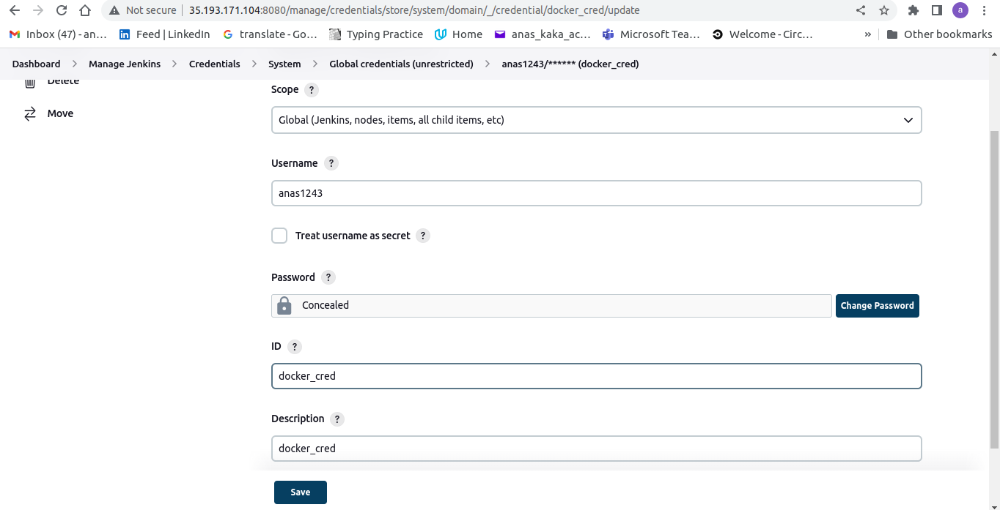
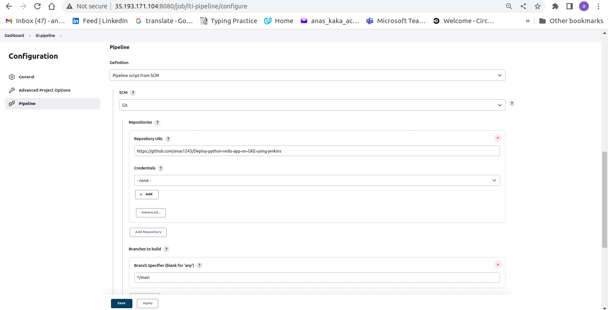

# Deploying Python-Redis app on GCP private Cluster with jenkins

This Is Part One

Part Two: https://github.com/anas1243/Deploy-python-redis-app-on-GKE-using-jenkins

This Project aimed to Deploy A containerized python-Redis web application on A GKE private cluster with jenkins deployment on another namespace

## Steps applied

### Infrastructure Provisioning using terraform

1. Configured A custom `VPC` with two `private subnets` subnet1 and subnet2
2. Configured A private `Bastion VM` on the subnet1 and A `Nat Gateway` to make sure that the bastion VM can download stuff from the internet
3. Configured A private `GKE cluster` on subnet2
4. Configured A `GCR` to push our application image on it
5. Configured two service accounts for both `Bastion VM` and the `private cluster`
6. Assigned the needed roles for both of them (container.admin and storage.admin)
7. Provisioned the infrastructure using the following command

- `cd terraform`
- `terraform apply --var-file var-files/prod.tfvars`

### Dockerize The Web Application

1. `cd jenkins-image`
2. Made the docker file after reading the documentation of jenkins carefully
3. Built,auth, and push the application image

- `docker build . -t anas1243/jenkins-with-docker`
- `docker push anas1243/jenkins-with-docker`

### Deploy The Jenkins Deployment

1. Connected to the `bastion VM` via `ssh`

- 

2. Connected to the `GKE Cluster` via `Bastion`

- 

3. cloned my code from `GitHub` to the `Bastion VM`

- 

4. Deployed the `jenkins Deployment`

```
cd provision-GKE-private-cluster-and-jenkins-deployment-using-terraform
kubectl apply -f Kubernetes/jenkins --recursive -n jenkins
kubectl get all -n jenkins
```

- 

5. Signed in To `jenkins dashboard` using the `External IP` of the `loadbalancer` mention in the previous screenshoot

- 

6. Added Docker Credintials

- 

7. Configured A Pipeline with a remote Jenkinsfile

- 

### Notice: The Following Repo Containing The Python Application Deployment

Repo: https://github.com/anas1243/Deploy-python-redis-app-on-GKE-using-jenkins
